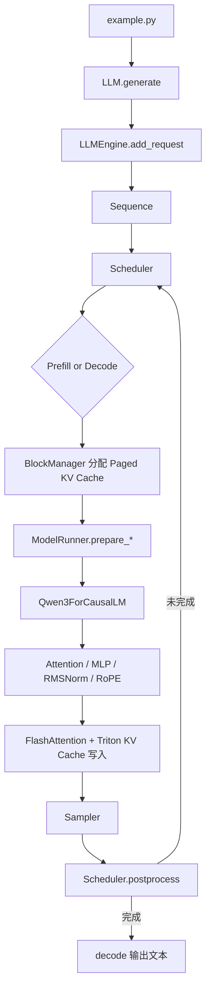

# Nano-vLLM 学习、扩展与优化路线

## 1. 最终目标

本路线的目标不是简单地“读完代码”或堆叠功能，而是把当前约 1,450 行的 nano-vLLM 逐步发展为一个能够体现以下能力的简历项目：

- 理解现代 LLM 推理引擎的完整执行链路；
- 能独立设计请求调度、KV Cache 管理和并行推理功能；
- 能建立可靠的正确性测试与性能基准；
- 能使用 PyTorch Profiler、Nsight 和 Triton 定位并优化 GPU 热点；
- 能用可复现的数据说明每次优化带来的收益与代价。

建议用 **16～20 周**完成主线，每周投入 8～12 小时。时间不足时，应优先保证“测试、基准、一个系统级优化、一个算子级优化”做深，而不是同时实现很多未经验证的功能。

最终项目应至少形成以下公开成果：

1. 一份架构说明和源码阅读笔记；
2. 一套正确性测试和可复现 benchmark；
3. 2～3 个由易到难的系统扩展；
4. 至少 2 个自研 Triton 算子，其中 1 个进入端到端推理路径；
5. 一份包含实验环境、测试方法、结果和结论的性能报告；
6. 一个清楚展示演进过程的 README、提交历史和项目演示。

---

## 2. 当前项目基线认知

### 2.1 当前已经具备的能力

在开始扩展前，先明确当前项目并不是简单的 Transformers 包装器，它已经包含：

- Qwen3 模型结构与 Safetensors 权重加载；
- Prefill 和 Decode 两阶段执行；
- Waiting/Running 队列与连续批处理；
- Chunked Prefill；
- Paged KV Cache；
- 基于块哈希的 Prefix Cache；
- KV Cache 不足时的请求抢占；
- FlashAttention Prefill 与 Decode；
- Tensor Parallel 和 NCCL 通信；
- Decode 阶段 CUDA Graph；
- RMSNorm、RoPE、SiLUAndMul、Sampler 的 `torch.compile`；
- Triton 实现的 KV Cache 写入算子。

当前项目的主要边界也很清楚：

- 只支持 Qwen3；
- 主要面向离线批量推理，不是完整在线服务；
- Sampling 能力较少；
- 测试、监控、benchmark 维度比较有限；
- 调度策略、Prefix Cache 淘汰和抢占策略较简单；
- 底层自研算子较少，Attention 主要依赖 FlashAttention。

这些边界正好构成后续扩展空间。

### 2.2 主调用链



学习时始终围绕两个问题阅读：

1. 一个请求从文本进入，到 token 输出，中间经历了哪些对象和状态变化？
2. 一批请求的数据如何从 CPU 侧的 Python 对象，变成 GPU 上的连续张量和 KV Cache 地址？

---

## 3. 第一层：深入掌握当前 Nano-vLLM

建议周期：**第 1～5 周**。

这一层的验收标准不是“代码都看过”，而是能够脱离源码讲清系统、画出数据流，并通过实验验证自己的理解。

### 阶段 1：建立可复现基线（第 1 周）

#### 学习内容

- Python 包结构、`pyproject.toml` 和 editable install；
- 模型目录中的 `config.json`、tokenizer 和 Safetensors；
- `example.py`、`bench.py` 的输入输出；
- `enforce_eager=True/False` 的差异；
- Prefill throughput 与 Decode throughput 的含义。

#### 实践任务

- 固定 Python、PyTorch、CUDA、Triton、FlashAttention 和 Transformers 版本；
- 记录 GPU 型号、显存、驱动和模型版本；
- 分别运行 eager 与 CUDA Graph 模式；
- 测量不同 batch size、prompt length、output length 下的吞吐和显存；
- 保留未经修改的 baseline 结果。

#### 产出

- `docs/environment.md`：环境与复现命令；
- `benchmarks/baseline.json`：机器可读结果；
- `docs/baseline.md`：实验条件、表格和初步结论。

> 原则：以后所有“优化了多少”都必须和这个固定基线比较。

### 阶段 2：理解请求生命周期和调度（第 2 周）

#### 阅读顺序

1. `example.py`
2. `nanovllm/llm.py`
3. `nanovllm/engine/llm_engine.py`
4. `nanovllm/engine/sequence.py`
5. `nanovllm/engine/scheduler.py`

#### 必须掌握

- `SequenceStatus.WAITING/RUNNING/FINISHED` 的转换；
- `num_tokens`、`num_cached_tokens`、`num_scheduled_tokens` 的区别；
- 为什么 Prefill 一次处理多个 token，而 Decode 每个序列只处理一个 token；
- Scheduler 如何在 Prefill 和 Decode 间做选择；
- KV Cache 不足时如何抢占并重新 Prefill；
- 当前 Chunked Prefill 的限制：一个 step 中只允许第一个序列被切块。

#### 实践任务

- 给 Scheduler 加可关闭的 debug trace；
- 构造 3 个不同 prompt 长度的请求，逐 step 输出状态转换；
- 画出每一步的 waiting/running 队列和 scheduled token 数；
- 为 `Sequence` 和 Scheduler 写纯 CPU 单元测试。

#### 自测问题

- 为什么 Decode 批次中的序列长度可以不同？
- 抢占后为什么要清空 block table？
- `extendleft(reversed(...))` 在这里维持了什么顺序？
- 长 Prompt 会怎样影响短请求的 TTFT？

### 阶段 3：理解 Paged KV Cache 与 Prefix Cache（第 3 周）

#### 阅读顺序

1. `nanovllm/engine/block_manager.py`
2. `ModelRunner.allocate_kv_cache`
3. `ModelRunner.prepare_prefill`
4. `ModelRunner.prepare_decode`
5. `nanovllm/layers/attention.py`

#### 必须掌握

- 一个逻辑 token block 如何映射到物理 KV Cache block；
- `block_table`、`slot_mapping`、`context_lens` 的含义和形状；
- KV Cache block 显存计算公式；
- Prefix Cache 如何通过前缀哈希复用完整块；
- `ref_count` 如何支持多个序列共享 block；
- 为什么最后一个未填满的 block 不适合作为稳定前缀缓存；
- Prefill 和 Decode 写入 KV Cache 的地址如何计算。

#### 实践任务

- 手工模拟 block size 较小时两个共享前缀请求的分配、引用和释放；
- 为 BlockManager 增加 allocate/deallocate/cache-hit 测试；
- 输出 Prefix Cache hit blocks、saved prefill tokens、cache hit rate；
- 验证共享 block 的 `ref_count` 在请求结束后回到正确值。

### 阶段 4：理解模型结构与 Tensor Parallel（第 4 周）

#### 阅读顺序

1. `nanovllm/models/qwen3.py`
2. `nanovllm/layers/linear.py`
3. `nanovllm/layers/embed_head.py`
4. `nanovllm/utils/loader.py`
5. `ModelRunner` 中的多进程和共享内存代码

#### 必须掌握

- Qwen3 Decoder Layer 的 Attention、MLP、Residual 和 RMSNorm；
- Q/K/V 和 Gate/Up 权重为什么进行 packed load；
- Column Parallel 与 Row Parallel 分别切哪个维度；
- 哪些位置需要 `all_reduce`、`gather`；
- rank 0 如何通过共享内存通知其他 GPU；
- Tensor Parallel 下 KV head 和词表如何切分。

#### 实践任务

- 打印单卡与双卡下关键权重 shape；
- 对比 TP=1 和 TP=2 的输出、显存、吞吐与通信开销；
- 用 Nsight Systems 或 PyTorch Profiler 找到 NCCL 通信位置；
- 写一份 `docs/tensor_parallel.md`，画出 QKV、MLP 和 LM Head 的切分图。

### 阶段 5：理解执行优化（第 5 周）

#### 阅读重点

- `warmup_model` 与显存峰值测量；
- `allocate_kv_cache` 的剩余显存估算；
- `capture_cudagraph` 的 batch size buckets；
- `run_model` 中 eager、prefill 和 CUDA Graph 的分支；
- FlashAttention 的 varlen 与 KV Cache 接口；
- `@torch.compile` 对小算子的融合效果；
- `store_kvcache_kernel` 的 program、stride 和地址计算。

#### 实践任务

- 比较 eager 与 CUDA Graph 下 Decode latency；
- 用 profiler 观察 kernel launch 数量；
- 比较首次运行、warmup 后运行的差异；
- 解释为什么 CUDA Graph 只用于 Decode，而当前 Prefill 仍走 eager；
- 完成 `docs/architecture.md`，能够在 10～15 分钟内讲清整个引擎。

### 第一层验收

完成以下内容后再进入扩展阶段：

- 能画出请求状态、KV Cache 地址和模型执行三条链路；
- 至少有 Scheduler、BlockManager、SamplingParams 的单元测试；
- 能解释 Prefill、Decode、PagedAttention、Prefix Cache、Tensor Parallel、CUDA Graph；
- 有一套可重复运行的 baseline benchmark；
- 能通过日志回答“某个 step 为什么调度了这些序列”。

---

## 4. 第二层：由易到难扩展和优化

建议周期：**第 6～13 周**。

扩展顺序遵循：先建立测量与正确性保障，再改功能，再改调度与内存，最后做复杂推理能力。每个阶段单独建立分支和实验报告。

### 扩展 1：测试、Benchmark 与可观测性（容易，第 6 周）

这是后续所有优化的基础，也非常适合作为第一个工程化提交。

#### 实现内容

- 使用 Transformers 作为小规模正确性参考；
- 增加 greedy decoding，便于做确定性输出对比；
- benchmark 增加 TTFT、TPOT、端到端 latency、吞吐、峰值显存；
- 输出 P50/P95/P99，而不仅是平均值；
- 增加 Prefix Cache hit rate、抢占次数、batch utilization；
- 将 benchmark 参数和结果保存为 JSON/CSV。

#### 验收

- 同一环境运行多次结果波动可解释；
- 每个优化 PR 自动运行单元测试；
- 正确性与性能测试分开，避免为了速度放松数值正确性。

### 扩展 2：完善 Sampling（容易，第 7 周）

#### 推荐顺序

1. greedy decoding；
2. seed 与可复现采样；
3. top-k；
4. top-p；
5. repetition penalty；
6. stop token IDs / stop strings。

#### 学习价值

- 理解 logits processing 与 sampling 的边界；
- 处理每请求不同采样参数的批量执行；
- 为后续 fused sampler 算子建立功能基线。

#### 验收

- 与 Transformers 在固定 logits 上逐项对比；
- 覆盖 temperature、top-k、top-p 的边界条件；
- Sampling 不应破坏 Tensor Parallel rank 0 的职责。

### 扩展 3：流式输出与异步请求接口（中等，第 8 周）

#### 实现内容

- 将 `generate` 拆成请求提交、engine step 和结果消费；
- 支持每生成一个 token 就返回增量结果；
- 支持请求取消和超时；
- 可选：增加最小 FastAPI/OpenAI-compatible endpoint。

#### 学习价值

- 从离线 batch 推理过渡到在线推理；
- 理解请求到达、调度 step 和客户端消费速度之间的关系；
- 为真实的 TTFT、TPOT 测量建立入口。

#### 边界

这一阶段只做最小服务层，不要把时间消耗在鉴权、数据库或复杂前端上。简历重点仍然是推理引擎。

### 扩展 4：调度器实验平台（中等，第 9～10 周）

#### 推荐实现

- 把 FCFS 策略抽象为可替换 Scheduler Policy；
- 改进 Chunked Prefill，使多个序列可以在同一步中分配 token budget；
- 增加 Decode-priority、Prefill-priority 或公平调度策略；
- 增加 priority request 和最大等待时间；
- 比较重计算 Prefill 与 Decode 抢占时的代价；
- 记录队列长度、batch composition 和 starvation。

#### 实验工作负载

- 全短请求；
- 全长 Prompt；
- 长短请求混合；
- Prefix 高复用；
- 突发流量；
- 显存紧张并发生抢占。

#### 核心指标

- TTFT P50/P95/P99；
- TPOT P50/P95/P99；
- request throughput；
- starvation 次数；
- GPU batch utilization；
- preemption/recompute tokens。

### 扩展 5：Prefix Cache 与 KV Cache 管理优化（中高，第 11 周）

#### 推荐实现

- 完整的 cache hit/miss/eviction 指标；
- 明确的空闲缓存块淘汰策略，例如 LRU；
- 哈希冲突与 token 二次校验测试；
- 不同 block size 对碎片、命中率和吞吐的影响实验；
- 避免高命中前缀被过早淘汰；
- 分析抢占策略对 Prefix Cache 的破坏。

#### 可选提高项

- Copy-on-Write，用于共享块之后发生分叉的场景；
- KV Cache offload 到 CPU；
- FP8/INT8 KV Cache，为第三层算子优化铺路。

### 扩展 6：增加第二种模型架构（中高，第 12 周）

推荐支持 Llama 系列的小模型，而不是再复制一份 Qwen3 代码。

#### 实现原则

- 提取通用 Decoder、Attention、MLP 和模型注册接口；
- 将模型差异限制在 config 映射、norm、RoPE、QKV bias 等位置；
- 权重加载器使用清晰的 name mapping；
- 同一套 Scheduler、KV Cache 和 ModelRunner 服务两种模型。

#### 简历价值

这一项证明项目从“针对单模型的演示代码”演进为“可扩展推理框架”。

### 扩展 7：选择一个高难度主项目（第 13 周及以后）

下面三项选择一项做深，不建议同时开工。

#### 方向 A：Speculative Decoding

- 增加 draft model；
- 实现 draft、verify、accept/reject 流程；
- 处理每个序列不同接受长度；
- 统计 acceptance rate 与实际加速；
- 分析额外显存和低接受率下的退化。

适合突出：推理算法、调度和复杂状态管理。

#### 方向 B：量化推理

- 先做 weight-only INT8/INT4 Linear；
- 实现离线权重量化和加载；
- 再考虑 FP8/INT8 KV Cache；
- 报告精度、显存、吞吐和不同 batch 下的变化。

适合突出：模型压缩、GPU kernel 和显存优化。

#### 方向 C：多 GPU 通信优化

- 分析 Tensor Parallel 下每层 all-reduce；
- 统计计算与通信占比；
- 尝试 async collective、通信计算 overlap 或 fused collective；
- 对比 1/2 GPU 的 scaling efficiency；
- 分析小 batch 下 TP 可能变慢的原因。

适合当前多 GPU 环境，突出：分布式推理和性能分析。

---

## 5. 第三层：底层算子优化路线

建议周期：**第 14～20 周**，可与第二层后半段交叉进行。

算子优化必须遵守以下闭环：

```text
正确的 PyTorch Reference
    → 单算子 Benchmark
    → Profiler 定位瓶颈
    → Triton/CUDA 实现
    → 数值正确性测试
    → Shape Grid 性能测试
    → 接入端到端
    → 重新测量吞吐和延迟
```

只展示单个 shape 上的 kernel 加速不够；最终必须回答它是否改善真实 Decode 或 Prefill。

### 5.1 算子基础准备（第 14 周）

#### 需要掌握

- GPU 的 SM、warp、block、shared memory、register；
- coalesced memory access、memory bandwidth、occupancy；
- reduction、mask、stride、layout；
- kernel launch overhead；
- FP32 accumulation 与 FP16/BF16 输入；
- Roofline：算子是 compute-bound 还是 memory-bound；
- Triton 的 program id、block size、`tl.arange`、`tl.load/store`；
- CUDA event 的正确计时方法。

#### 工具

- `torch.profiler`：确定 PyTorch 调用和 kernel 时间；
- `triton.testing.do_bench`：微基准；
- Nsight Systems：看 CPU/GPU timeline、launch 和 NCCL；
- Nsight Compute：看带宽、occupancy、warp stall 和访存效率。

#### 统一 Benchmark 规范

- warmup 后计时；
- 固定 dtype、device 和随机种子；
- 覆盖真实 shape，而不是只测一个 shape；
- 报告 median/P20/P80 或 P50/P95；
- 同时对比 PyTorch eager、`torch.compile`、Triton；
- 每个算子都有 `torch.testing.assert_close`；
- 对非确定采样算子，分离数值测试与分布测试。

### 5.2 算子 1：优化 KV Cache 写入（容易，第 15 周）

当前项目已经有 `store_kvcache_kernel`，它是最自然的第一个 Triton 练习。

#### 任务

- 写清输入 shape、stride 和 slot mapping；
- 补充越界 mask 和 shape 约束；
- 对 D 较大时拆分 program，比较“一 token 一个 program”和二维 grid；
- 调整 BLOCK_SIZE、num_warps；
- 测试连续 slot、随机 slot、包含 `-1` slot 的情况；
- 对比 PyTorch index copy/reference；
- 报告实际内存带宽和 Decode/Prefill 中占比。

#### 验收

- 所有真实模型 shape 数值一致；
- 性能报告包含小 batch 与大 token batch；
- 接入端到端后没有破坏 Prefix Cache 和 CUDA Graph。

### 5.3 算子 2：Fused Add + RMSNorm（中等，第 16 周）

当前 RMSNorm 依赖 `torch.compile`，适合实现显式 Triton 版本。

#### 任务

- 先实现纯 RMSNorm；
- 再实现 residual add + RMSNorm 融合；
- FP32 accumulation，输出恢复原 dtype；
- 处理 hidden size 不同和非 2 次幂；
- 比较 PyTorch eager、`torch.compile`、Triton；
- 分析融合减少了几次全局内存读写和 kernel launch。

#### 验收

- 覆盖 Qwen3 各层真实 shape；
- 单算子结果与端到端 logits 均通过误差阈值；
- 用 profiler 证明 kernel 数量或 memory traffic 的变化。

### 5.4 算子 3：Fused SiLUAndMul / RoPE（中等，第 17 周）

可先做 SiLUAndMul，再根据结果决定是否继续 RoPE。

#### SiLUAndMul

- 融合 split、SiLU 和 elementwise multiply；
- 对不同 token 数和 intermediate size 调参；
- 分析该算子是否受内存带宽限制。

#### RoPE

- 融合 Q/K 的 cos、sin 读取和旋转；
- 避免中间 `float()`、`cat()` 和多次 tensor materialization；
- 处理 position lookup 和不同 head 数；
- 可进一步探索 Q/K Norm + RoPE 融合，但要控制寄存器压力。

### 5.5 算子 4：Fused Sampling（中高，第 18 周）

在第二层已完成 top-k/top-p 后，再开始该算子。

#### 任务

- 融合 temperature scaling、softmax 或候选裁剪；
- 为 greedy/top-k/top-p 分别设计路径；
- 避免为每个请求创建大量中间张量；
- 测试不同 vocab size 和 batch size；
- 使用统计测试验证采样分布，而不是要求随机 token 完全相同。

#### 关注点

Decode 时 batch 往往不大，kernel launch 和全词表访存都很重要。应报告它在小 batch 下是否真正有收益。

### 5.6 旗舰算子：Paged Decode Attention（困难，第 19～20 周）

不要一开始重写完整 FlashAttention。先聚焦 nano-vLLM 最核心的单 token Decode Attention：

- query shape 通常是每序列一个 token；
- K/V 分散在物理 KV Cache blocks；
- `block_table` 提供逻辑块到物理块映射；
- `context_lens` 决定每个请求的有效长度；
- GQA 下 Q heads 与 KV heads 数量不同。

#### 分步实现

1. 单序列、单 KV head、固定 context length；
2. 多 head 与 GQA；
3. batch 中不同 context length；
4. Paged KV Cache block table；
5. online softmax，避免完整 attention score 落地；
6. 支持 FP16/BF16 与 FP32 accumulation；
7. autotune block size、num warps 和分块策略；
8. 接入 `Attention.forward`，保留 FlashAttention fallback。

#### 对比对象

- PyTorch reference；
- 当前 `flash_attn_with_kvcache`；
- 不同 batch、context length、head dim、GQA ratio；
- 单算子 latency、带宽和端到端 TPOT。

#### 验收

- 正确处理非整块长度和不同 block table；
- 数值误差有明确阈值；
- 在适合的 shape 上有可复现结果；
- 对不占优的 shape 保留 fallback，而不是强行替换；
- 最终报告端到端 Decode 改善，而不只报告 kernel speedup。

### 5.7 可选终极方向：量化 KV Cache

在 Paged Decode Attention 正确后，可以加入 FP8/INT8 KV Cache：

- KV 写入时量化并保存 scale；
- Attention 读取时反量化或融合反量化；
- 比较 KV Cache 容量、最大并发、带宽和精度；
- 分析小模型下算子开销是否抵消带宽收益。

这一方向能把“系统内存管理”和“底层算子”连接起来，适合作为最终亮点，但复杂度较高。

---

## 6. 推荐的主线组合

为了控制项目规模，建议采用以下组合，而不是实现所有候选项：

### 必做主线

1. 架构学习与完整文档；
2. 正确性测试、benchmark、profiling；
3. Sampling 完善；
4. 调度器优化；
5. Prefix/KV Cache 指标与淘汰优化；
6. Triton Fused RMSNorm；
7. Triton Paged Decode Attention。

### 三选一亮点

- Speculative Decoding；
- Weight/KV Cache Quantization；
- Tensor Parallel 通信优化。

这套组合同时覆盖 API、调度、内存管理、模型执行和 GPU kernel，简历叙事比较完整。

---

## 7. 每个阶段的工程规范

### 7.1 一次优化的标准流程

每项工作都按下面顺序完成：

1. 写问题定义：当前瓶颈是什么；
2. 补正确性测试；
3. 采集修改前 baseline；
4. 实现最小版本；
5. 做 profiler 和 benchmark；
6. 分析收益、退化和适用边界；
7. 更新文档；
8. 提交一个主题清晰的 commit/PR。

### 7.2 建议目录

```text
docs/
├── architecture.md
├── environment.md
├── baseline.md
├── scheduler.md
├── kv_cache.md
├── tensor_parallel.md
└── kernels/
    ├── rmsnorm.md
    └── paged_attention.md

tests/
├── engine/
├── layers/
└── kernels/

benchmarks/
├── benchmark_engine.py
├── benchmark_kernels.py
├── workloads/
└── results/
```

### 7.3 性能报告必须记录

- Git commit；
- GPU、CPU、显存、驱动；
- Python/PyTorch/CUDA/Triton/FlashAttention 版本；
- 模型与 dtype；
- batch size、prompt/output length 分布；
- warmup 与重复次数；
- eager/CUDA Graph/TP 配置；
- 正确性误差阈值；
- 原始数据和绘图脚本。

---

## 8. 简历与面试呈现

### 8.1 不要这样描述

> 阅读了 nano-vLLM，并增加了一些算子优化。

这无法体现问题、方法和结果。

### 8.2 推荐描述模板

以下数据必须替换为自己的真实测量结果：

> 基于 nano-vLLM 构建轻量级 LLM 推理引擎，完成连续批处理、Paged KV Cache、Prefix Cache、Tensor Parallel 和 CUDA Graph 执行链路分析，并建立覆盖 TTFT、TPOT、吞吐及显存的可复现 benchmark。

> 重构请求调度器并实现多请求 Chunked Prefill/优先级策略，在长短请求混合负载下将 P95 TTFT 从 X ms 降至 Y ms，同时保持吞吐变化在 Z% 以内。

> 使用 Triton 实现 Fused Add+RMSNorm 与 Paged Decode Attention，通过 Nsight 分析访存和 kernel launch；在 RTX 3090、指定 shape 下单算子获得 X 倍加速，端到端 TPOT 改善 Y%。

> 增加正确性测试、性能回归和实验报告，对比 PyTorch/Transformers/FlashAttention reference，覆盖 FP16/BF16、不同 batch 和 context length。

### 8.3 面试时应能回答

- Paged KV Cache 为什么能减少显存碎片？
- Prefix Cache 与普通 KV Cache 的关系是什么？
- Prefill 和 Decode 为什么性能特征不同？
- Continuous Batching 如何提高 GPU 利用率？
- Chunked Prefill 如何影响 TTFT 和吞吐？
- Tensor Parallel 为什么在小 batch 下可能不加速？
- CUDA Graph 解决了什么问题，又引入了哪些限制？
- 一个 Triton 算子为什么更快，瓶颈是计算还是访存？
- 单算子快 2 倍为什么端到端可能只快 3%？
- 你的优化在哪些 shape 下退化，为什么保留 fallback？

---

## 9. 里程碑总览

| 周期 | 里程碑 | 可验证产出 |
|---|---|---|
| 第 1 周 | 环境与基线 | environment、baseline、可复现脚本 |
| 第 2～3 周 | 调度与 KV Cache | 状态 trace、单测、KV Cache 图解 |
| 第 4～5 周 | 模型、TP、CUDA Graph | architecture、TP 分析、profiler 结果 |
| 第 6～7 周 | 测试与 Sampling | 正确性框架、greedy/top-k/top-p |
| 第 8～10 周 | 在线接口与调度优化 | streaming、调度策略、tail latency 报告 |
| 第 11～12 周 | Cache 与模型扩展 | LRU/指标、第二模型架构 |
| 第 13 周 | 高难主项目起步 | Speculative/Quantization/TP 三选一 |
| 第 14～17 周 | Triton 基础算子 | KV write、RMSNorm、SiLU/RoPE |
| 第 18～20 周 | 旗舰算子与收尾 | Sampling/Paged Attention、端到端报告 |

---

## 10. 第一批立即执行的任务

从现在开始，先完成下面五件事：

1. 保留当前可运行版本，记录依赖和 GPU 环境；
2. 扩展 `bench.py`，保存吞吐、TTFT、TPOT 和显存基线；
3. 为 Sequence、Scheduler、BlockManager 建立第一批单元测试；
4. 增加可关闭的 Scheduler/BlockManager trace，跟踪两个共享前缀请求；
5. 写 `docs/architecture.md`，按一次真实请求标注每个关键 tensor 的 shape。

完成这五项后，项目就从“能运行的源码”进入了“可研究、可扩展、可量化优化”的状态。
